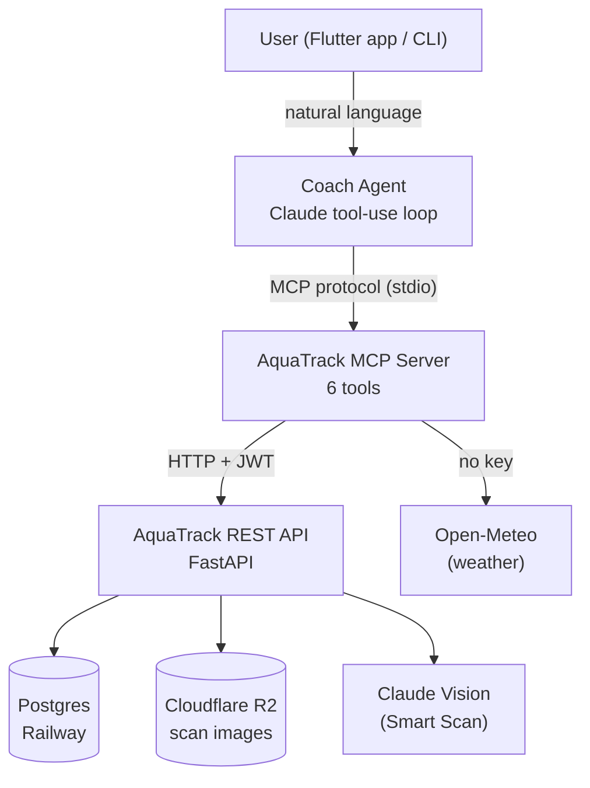

# AquaTrack — an AI hydration concierge

> Chụp ảnh ly nước → AI đếm ml → một trợ lý biết *hành động* giúp bạn uống đủ nước mỗi ngày.

**Kaggle "AI Agents: Intensive Vibe Coding" Capstone — Track: Concierge Agents.**

AquaTrack is a hydration app whose centrepiece is the **Coach Agent**: a personal
concierge that reasons over your hydration data, checks the weather, reads a
photo of your drink, and *takes actions on your behalf* — logging water,
adjusting your daily goal — instead of being a passive chatbot.

---

## The problem

Staying hydrated is a small daily habit with an outsized effect on health, focus,
and mood — yet most hydration apps are glorified counters. They make **you** do
all the work: estimate the volume of every drink, tap to log it, remember your
goal, and figure out whether today's heat means you should drink more. The
friction is exactly why people stop using them.

## The solution — and why an agent

AquaTrack removes that friction by putting a real **agent** between the user and
their data. You talk to the Coach in plain language; it does the rest:

- *"Mình vừa uống 1 ly 300ml, hôm nay đủ chưa?"* → it **logs** the drink and tells
  you where you stand.
- *"Hà Nội nóng không, mình cần uống thêm không?"* → it **checks the weather**,
  factors heat into the advice, and **proposes a higher goal** (asking first).
- *(snap a photo)* → **Smart Scan** estimates the volume, then it logs it once you
  confirm.

**Why an agent and not a feature?** Each of those needs *reasoning over multiple
steps and tools* — read progress, read weather, decide, then act — and the right
sequence depends on what the user said. That is precisely what an agentic
tool-use loop does well and a single prompt does not. The agent makes hydration
feel like a conversation with someone who already knows your numbers.

---

## Architecture



Three composable layers, each a separate process with a clear boundary:

1. **REST API** (`aquatrack_backend/app/`) — FastAPI + SQLAlchemy. All business
   logic lives here: hydration factors, XP, goal resolution, JWT auth, Smart Scan
   (Claude Vision with structured outputs), persistence to Postgres + R2.
2. **MCP Server** (`aquatrack_backend/mcp_server/`) — a thin Model Context
   Protocol ⇄ HTTP bridge. It exposes the API's capabilities as agent tools,
   calling the REST API with the user's JWT. Dependency-light (`mcp` + `httpx`)
   so it never re-implements business logic.
3. **Coach Agent** (`aquatrack_backend/agent/`) — a Claude tool-use loop that
   connects to the MCP server as a client, and reasons → calls tools → acts until
   the user's request is answered or done.

### The agent's tools (via MCP)

| Tool | Action? | What it does |
|---|---|---|
| `get_today_hydration` | read | Today's goal, effective intake, remaining ml, % of goal |
| `get_weekly_stats` | read | Last 7 days: per-day progress + achievement rate |
| `log_water(volume_ml, liquid_type)` | **action** | Logs a drink; returns updated progress |
| `update_daily_goal(goal_ml)` | **action** | Sets the daily goal (1000–5000 ml) |
| `get_weather(latitude, longitude)` | read | Temp + humidity (Open-Meteo, no key) + hydration hint |
| `analyze_drink_photo(image_path)` | read | Smart Scan: estimate volume/type/confidence from a photo |

---

## Course concepts demonstrated

| Concept | Where | Evidence |
|---|---|---|
| **MCP Server** | Code | `aquatrack_backend/mcp_server/` — 6 tools bridging the API |
| **Agent / multi-step tool use** | Code | `aquatrack_backend/agent/coach_agent.py` — Claude tool-use loop |
| **Deployability** | Live | Backend on Railway + managed Postgres + Cloudflare R2 |
| **Security features** | Code | JWT per-user isolation, confirm-before-action, no secrets in code |

## Tech stack

- **Agent:** Claude (Anthropic) tool-use loop · Model Context Protocol (`mcp`)
- **Backend:** FastAPI · SQLAlchemy · Pydantic · Python 3.11
- **AI:** Claude Vision (Smart Scan, structured outputs) · Claude (Coach, insights)
- **Data:** Postgres (Railway) · Cloudflare R2 (durable scan-image storage)
- **App:** Flutter · Riverpod
- **Weather:** Open-Meteo (key-less)

---

## Repository structure

```
aquatrack_backend/
  app/            FastAPI REST API (business logic, auth, Smart Scan)
  mcp_server/     MCP server — exposes the API as agent tools   ← MCP Server concept
  agent/          Coach Agent — Claude tool-use loop over MCP   ← Agent concept
aquatrack_app/    Flutter client
aquatrack_ml/     ML experiments (training data pipeline)
docs/             ADRs, capstone writeup, design prototype
```

## Setup & run

### 1. Backend (REST API)

```bash
cd aquatrack_backend
python -m venv .venv && . .venv/Scripts/activate   # Windows (. .venv/bin/activate on *nix)
pip install -r requirements.txt
cp .env.example .env        # fill in SECRET_KEY, ANTHROPIC_API_KEY, etc.
uvicorn app.main:app --reload
```

The deployed instance runs on Railway; point the tools at it with
`AQUATRACK_API_BASE_URL`.

### 2. MCP Server + Coach Agent

The agent and the MCP server share one venv (separate from the backend — `mcp`
pulls a newer Starlette than FastAPI pins):

```bash
cd aquatrack_backend/agent
python -m venv .venv && . .venv/Scripts/activate
pip install -r requirements.txt

export ANTHROPIC_API_KEY="sk-ant-..."
export AQUATRACK_API_BASE_URL="https://<your-app>.up.railway.app"
export AQUATRACK_USER_TOKEN="$(curl -s -X POST "$AQUATRACK_API_BASE_URL/api/v1/auth/login" \
  -H 'Content-Type: application/json' \
  -d '{"email":"you@example.com","password":"..."}' | jq -r .access_token)"

cd .. && python -m agent.coach_agent "Mình vừa uống 1 ly 300ml, hôm nay đủ chưa?"
```

Run with no argument for an interactive chat. Tool calls are printed inline so you
can watch the agent reason and act. To inspect the MCP tools directly, use the
MCP Inspector — see [`aquatrack_backend/mcp_server/README.md`](aquatrack_backend/mcp_server/README.md).

## Deployment

- **Backend + Postgres:** Railway (managed Postgres injected via `DATABASE_URL`).
- **Scan images:** Cloudflare R2 (S3-compatible, zero egress) — Railway's
  container disk is ephemeral, so training images go to R2 (`R2_*` env vars).
- Reproduce: set the env vars in `aquatrack_backend/.env.example` on your host;
  the backend resolves Postgres when `DATABASE_URL` is present and R2 when the
  `R2_*` vars are set, otherwise falls back to SQLite + local disk for dev.

## Security

- **Per-user isolation** — every MCP tool call carries the user's JWT; the API
  enforces that data and actions belong to that user only.
- **Confirm before acting** — the agent's system prompt requires confirmation
  before data-changing actions (`log_water`, `update_daily_goal`); it won't log
  hypotheticals or change goals unasked.
- **No secrets in code** — all keys/tokens come from the environment; `.env` is
  gitignored.
- **The agent never handles credentials** — the JWT lives in the MCP server's
  environment, not in tool arguments or the model's context.

## Documentation

- Capstone writeup: [`docs/CAPSTONE_WRITEUP.md`](docs/CAPSTONE_WRITEUP.md)
- Architecture decisions: [`docs/adr/`](docs/adr/)
- Demo video: _(YouTube link — added at submission)_
